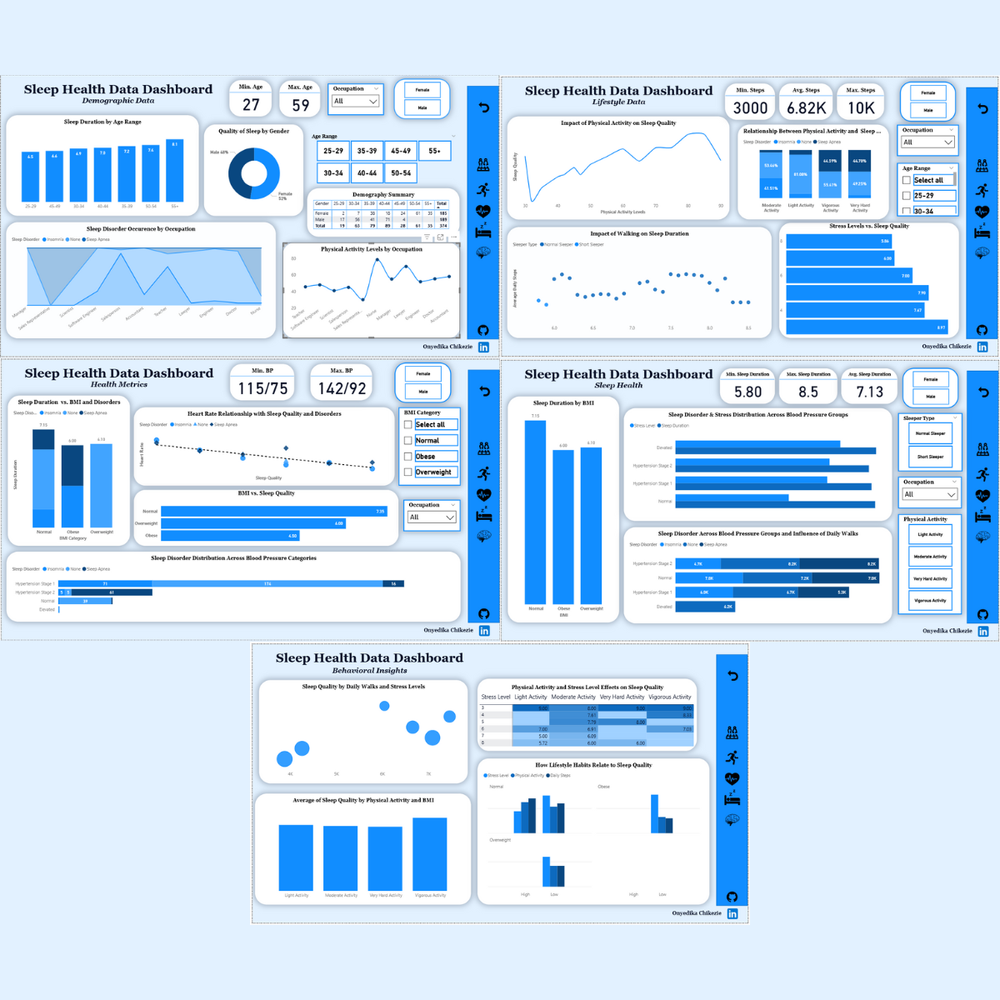

# Sleep Health and Lifestyle Analysis

This project explores the influence of lifestyle, demographic variables, and health variables on sleep outcomes. Using a blend of statistical analysis, visual storytelling, and behavioral insight techniques, this analysis aims to provide actionable insights that can help individuals and organizations improve sleep health outcomes.

---

## Tools Used
- **Excel** for cleaning data.
- **Power BI** for visualisation.
- **R script** for documentation.
- **GitHub** for project hosting.

---

## Project Objectives
1. Understand the relationship between age and sleep duration.
2. Explore gender differences in reported sleep quality.
3. Identify occupations more prone to sleep disorders.
4. Examine how physical activity levels affect sleep health.
5. Investigate how BMI and stress interact with sleep duration and disorders.
6. Provide practical, data-driven recommendations for healthier sleep habits.

---

## 📈 Key Insights
- Sleep duration increases with age, with the 55+ group getting the most sleep.
- Females report higher sleep quality than males.
- Occupations like teacher, nurse, and sales show higher instances of sleep disorders.
- Low stress, higher physical activity, and healthy BMI are linked to better sleep.
- Those with short sleep duration often have higher BMI, lower physical activity levels, and higher stress levels.

---

##  Insights Dashboard

  

Explore the interactive Power BI dashboard for dynamic filtering by occupation, gender, physical activity, and more.

---

## Project Links

 🔗 [View Full HTML Report](https://eziesly.github.io/sleep-health-and-lifestyle-analysis/sleephealthdata.html)
 📥 [Download Interactive Power BI Dashboard](https://github.com/eziesly/Sleep-Health-and-Lifestyle-Analysis/blob/main/Sleep_Health_Data_Dashboard.pbix)

---

## Files Included
- `Sleep_health_data_doc.Rmd` – R Markdown notebook
- `sleephealthdata.html` – Rendered HTML report
- `Sleep_Health_and_Lifestyle_Clean_Data.csv.xlsx` – Spreadsheets containing raw data and cleaned dataset
- `Sleep_Health_Data_Dashboard.pbix` – Power BI dashboard file
- `README.md` – Project overview and documentation

---

## Connect With Me
Feel free to connect or reach out:
- [LinkedIn]([https://www.linkedin.com/in/your-profile](https://www.linkedin.com/in/onyedika-chikezie-55978a21a/))
-  chikeziesly@gmail.com
